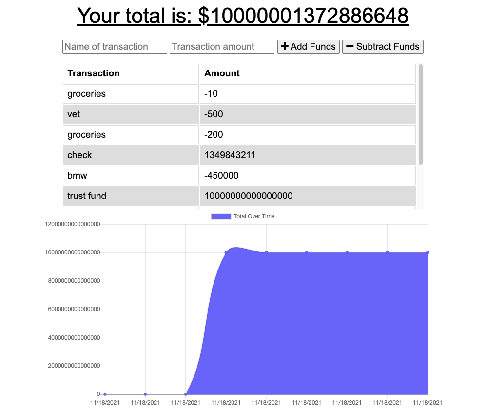

# Budget-Tracker

## Description
This application is an online/ offline budget tracker that allows for online access and functionality. 

## Table of contents
  - [Installation](#installation)
  - [Usage](#usage)
  - [Credits](#credits)
  - [License](#license)
  - [Test](#test)
  - [Questions](#questions)
  

## Installation
Heroku URL link  : ***https://budget-tracker-ismeny.herokuapp.com/***  

  

## Usage
When the user visits the website they will be able to track their withdrawals and deposits with our without a data/ internet connection so that their account balance is accurate when traveling. 

## Credits
Received help from:  

Jayla De'nae - Github: https://github.com/jayladenae   

Stephanie Cortez - Github: https://github.com/CortezStephanie   

## License

## Contributions
n/a
## Test
n/a
## Questions
Github: Ismeny Saguilan - https://github.com/Ismeny  
Email: menysag2@gmail.com